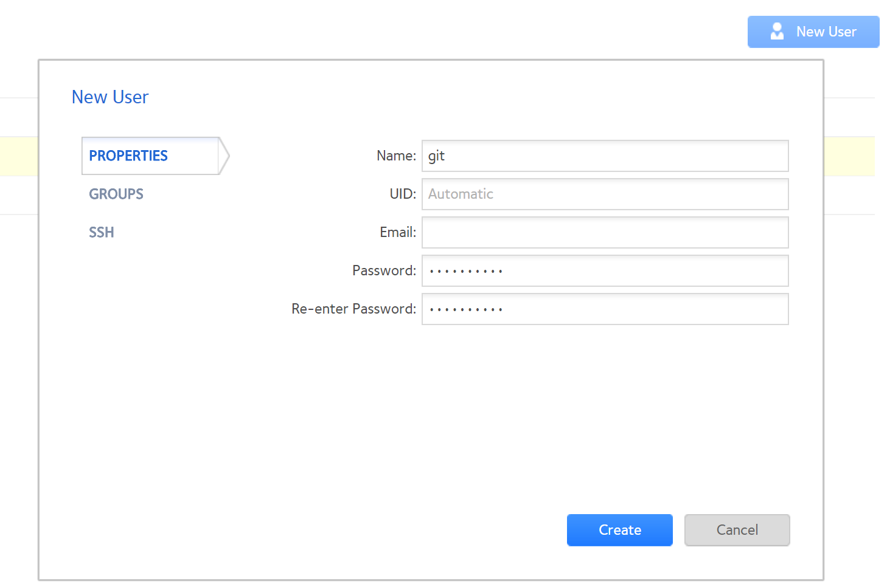
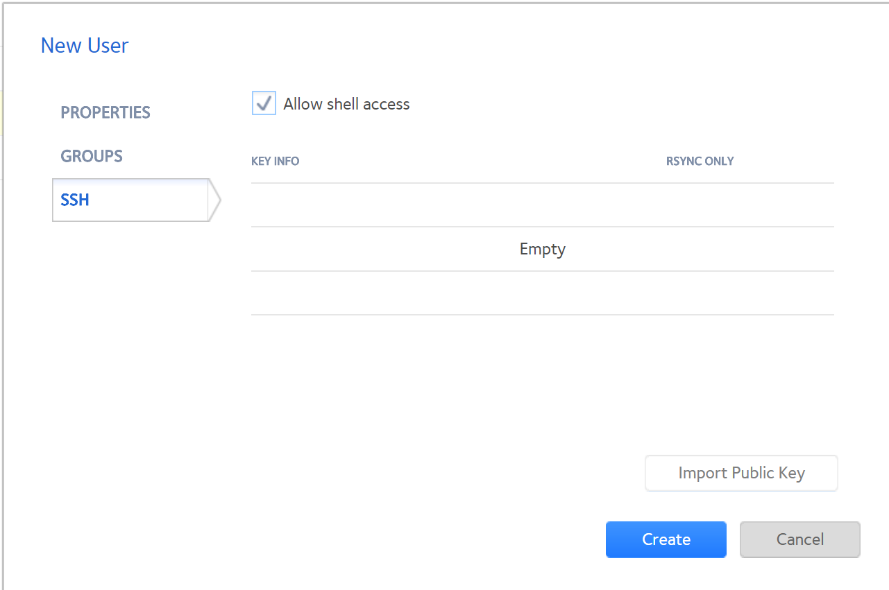

# gitlist ReadyNAS setup

This is a an experiement with creating github repository with Web Interface for Git Repos on a NetGear ReadyNAS 104 system and [gitlist](https://github.com/klaussilveira/gitlist). Utlimate goal will be to sync with **Google Drive** and considering: Dropbox, Box, OneDrive...

## System Information & Requirements

### System Informaton:

* **Model:** ReadyNAS 104

* **Firmware Name:** ReadyNASOS

* **Firmware Version:** 6.9.3

### Requirements:

* Apache2
* git
* PHP 5.3+  (Easy install from RadyNAS addon apps form Devloper: Poussin)


## Installation

### Install git

```sh

root@NAS01:~# apt-git install git git-core

```

### Installing and Configuring GitList

```sh
root@NAS01:~# cd /apps/

root@NAS01:~# wget https://github.com/klaussilveira/gitlist/releases/download/1.0.0/gitlist-1.0.0.tar.gz

root@NAS01:~# tar xzvf gitlist-1.0.0.tar.gz

root@NAS01:~# cd gitlist

root@NAS01:~# mkdir cache

root@NAS01:~# chmod 777 cache

root@NAS01:~# cp config.ini-example config.ini

root@NAS01:~# apt-get install vim

root@NAS01:~# vim config.ini

```


**Edit:** `config.ini` change `repositories[] = '/home/git/repos/'` optional include `baseurl = 'http://192.168.80.128:7082/'`

### config.ini

```sh
client = '/usr/bin/git' ; Your git executable path
default_branch = 'master' ; Default branch when HEAD is detached
#repositories[] = '/home/git/repos/' ; Path to your repositories
repositories[] = '/home/git/repos/' ; Path to your repositories
                                           ; If you wish to add more repositories, just add a new line

; WINDOWS USERS
;client = '"C:\Program Files (x86)\Git\bin\git.exe"' ; Your git executable path
;repositories[] = 'C:\Path\to\Repos\' ; Path to your repositories

; You can hide repositories from GitList, just copy this for each repository you want to hide or add a regex (including delimiters), eg. hidden[] = '/(.+)\.git/'
; hidden[] = '/home/git/repositories/BetaTest'

[app]
debug = false
cache = true
theme = "default"
title = ""
baseurl = 'http://192.168.80.128:7082/'

```

### Create User

Create new user under `Accounts` and add to ssh acces.

**New User**


**Allow SSH**



### http.conf

Addtional informaiton can be found on how readyNAS uses `apache2` configuration files: [OS 6.1.4 apache2 mod_rewrite .htaccess problem](https://community.netgear.com/t5/Using-your-ReadyNAS/OS-6-1-4-apache2-mod-rewrite-htaccess-problem/td-p/896062)

```sh
root@NAS01:~#  cd /apps/gitlist

root@NAS01:~# cp ../phpr6/http.conf .

root@NAS01:~# vim http.conf

```

**Edit:** `http.conf` chage `Listen 7082` **&** `DocumentRoot /apps/gitlist` **&** `<Directory /apps/gitlist>` **&** `ScriptAlias /cgi-bin /apps/gitlist`  **&** `ErrorLog /apps/gitlist/error.log`

```sh
Listen 7082
<VirtualHost *:7082>
        ServerAdmin admin@localhost

        DocumentRoot /apps/gitlist
        <Directory />
                Options FollowSymLinks
                AllowOverride None
        </Directory>
        <Directory /apps/gitlist>
                Options Indexes FollowSymLinks MultiViews
                AllowOverride None
                Order allow,deny
                allow from all
        </Directory>
        ScriptAlias /cgi-bin /apps/gitlist

        ErrorLog /apps/gitlist/error.log
        LogLevel warn
</VirtualHost>
```

> **NOTE**
> The `/etc/apache2/sites-enabled/` allow for virtualhost
>

```sh
root@NAS01:~# ls -la /etc/apache2/sites-enabled/
total 16
drwxr-xr-x 1  115 guest 106 Jun  8 09:43 .
drwxr-xr-x 1 root root  188 Jun  7 14:14 ..
lrwxrwxrwx 1 root root   36 Jun  7 14:57 000-fv-http -> /etc/apache2/sites-available/fv-http
lrwxrwxrwx 1 root root   27 Jun  7 14:14 000-fv-https -> ../sites-available/fv-https
lrwxrwxrwx 1 root root   21 Jun  8 09:40 090-phpr6.conf -> /apps/phpr6/http.conf

```
**symlink**

```sh
root@NAS01:~# ln -s /apps/gitlist/http.conf /etc/apache2/sites-enabled/099-gitlsit.conf
```

```sh
root@NAS01:~# ls -la  /etc/apache2/sites-enabled/099-gitlist.conf
lrwxrwxrwx 1 root root 23 Jun  8 09:40 /etc/apache2/sites-enabled/099-gitlist.conf -> /apps/gitlist/http.conf
```

**Reload Apache configuration**

```sh
root@NAS01:~# /etc/init.d/apache2 reload

```

#### Errors

_ERROR:_ Please, edit the config file and provide your repositories directory

_FIX:_ Permisions on `/home/<username>`  `drwx------ 1 git   users` to `drwx------ 1 git   users` with <kbd>chmod 755 /home/git/</kbd>

_ERROR:_ When selecting repository http://192.168.80.128:7082/gitlist/
> **Not Found**
>
> The requested URL /gitlist/ was not found on this server.

_FIX:_ use the `index.php` path http://192.168.80.128:7082/index.php

## Usage

This is for documenting my steps as I have a very bad habit of doing things and forgetting what I did down the road. Hopeing someone can find some use for this.

## Contributing

Open to any feedback on this setup as it can documenation needs some work with formating and steps. This is my frist use of markdown languge along with the learning curve of git. I am dusting off the old linux in the proces. Hopfully someone finds this usefull.


## Credits

[How To: Install and Configure GitWeb](https://gofedora.com/how-to-install-configure-gitweb/) (Considered this, but was challnaged and could not get it running)

[Insanely Awesome Web Interface for Your Git Repos](https://gofedora.com/insanely-awesome-web-interface-git-repos/)
